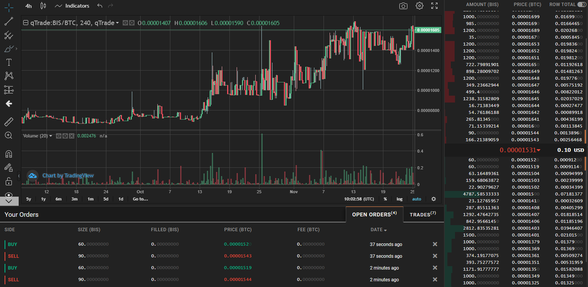

# qTrader
Welcome to the qTrade trading bot.

## Demo

### What does a demo offer?
Demo version is available for free.
It allows you to set buy orders at best possible price for $BIS and $NYZO. No selling is available. It lets you accumulate at the best possible price in a given moment.

# Full version
### What does this bot offer?
This bot places buy and sell orders for you at the best possible price, and at the best possible exposure.

### What is the premise?
Market spread is an inefficiency, which can be exploited by covering both sides of it while the difference is higher than market fees. Nothing new.

### How do I run this bot?
On start, you will be asked for your API credentials. You need to obtain these from [https://qtrade.io/settings/api_keys](https://qtrade.io/settings/api_keys)
There is a configuration file `config.json` where you set your trading parameters.

### Config File
Bot configuration is set at `config.json` file.
Buy orders are placed on top of the buy order book, with an increase of `price_adjustment`.

Sell orders are placed on top of the sell order book, with a decrease of `price_adjustment`.

The minimum spread between orders is defined by `spread_pct_min`.

Order book recalculation is set by `ttl` in seconds. However, pauses between runs are set at 90 seconds static.

### What returns can I expect?

The bot profits the most from a stable price range with a high spread. It works actively towards lowering the spread in order to beat other trading bots and humans.

### What should I be aware of?

This bot does **not** track individual order performance, because that would require static orders. Static orders are not favorable due to their inert nature, which results in them getting stuck forever outside the price range.

A very strong trend where there is only one type of trading going on (buys / sells only), this bot cannot operate properly. However, such situation should only be temporary.

### Tips

In an uptrend scenario, it might be a good idea to have a higher `sell_amount` than `buy_amount` in magnitude strong enough to knock down the price back to your buy orders.
The opposite is true for a downtrend.

